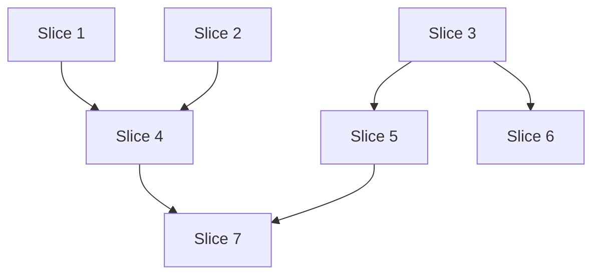

# Slice to Graph — Reference

## Pseudocode

### BuildLayers

```
FUNCTION BuildLayers(slices):
    deps = MAP each slice → list of blocker slice IDs
    layers = []
    resolved = {}
    remaining = all slice IDs

    WHILE remaining is not empty:
        current_layer = []
        FOR each id IN remaining:
            IF all deps[id] ARE IN resolved:
                ADD id TO current_layer
        IF current_layer is empty:
            ERROR "circular dependency among: {remaining}"
        ADD current_layer TO layers
        ADD current_layer TO resolved
        REMOVE current_layer FROM remaining

    RETURN layers
```

### ValidateLayers

```
FUNCTION ValidateLayers(layers, slices):
    FOR each layer IN layers:
        file_map = {}
        FOR each slice_id IN layer:
            FOR each file IN slices[slice_id].files_to_touch:
                IF file IN file_map:
                    RETURN CONFLICT(file, file_map[file], slice_id)
                        → abort, recommend split or reorder
                file_map[file] = slice_id
    RETURN OK
```

### BuildTask

```
FUNCTION BuildTask(slice, blockers, prev_output):
    task = ""

    IF blockers is not empty:
        task += "## PRIOR WORK\n"
        task += "The following was built in a previous layer (not on disk in your worktree,\n"
        task += "but described here for context):\n\n"
        task += prev_output
        task += "\n\nReference these file paths and interfaces when building.\n"
        task += "The files do not exist in your worktree — build against the described APIs.\n\n"

    task += "## SLICE SPEC\n"
    task += "Context: {slice.context}\n"
    task += "What to build: {slice.what}\n"
    task += "Files to touch: {slice.files}\n"
    task += "Acceptance criteria: {slice.acceptance}\n"
    task += "Verify: {slice.verify}\n"

    task += "\n## WORK\n"
    task += "Implement the slice in your isolated worktree. Commit your changes.\n"

    RETURN task
```

### ExecuteLayer

```
FUNCTION ExecuteLayer(layer, slices, prev, layer_index):
    tasks = []
    FOR each slice_id IN layer:
        blockers = slices[slice_id].blockers
        task_text = BuildTask(slices[slice_id], blockers, prev)
        ADD {
            agent: InferAgent(slices[slice_id]),
            task: task_text
        } TO tasks

    IF layer has exactly 1 slice:
        // Single-agent call
        CALL subagent tool with {
            agent: tasks[0].agent,
            task: tasks[0].task,
            async: false,           // ALWAYS false
            clarify: false          // ALWAYS false
        }
    ELSE:
        // Parallel call with worktrees
        CALL subagent tool with {
            tasks: tasks,
            worktree: true,        // ALWAYS true for parallel steps
            concurrency: 4,        // default, user can override
            async: false,          // ALWAYS false
            clarify: false         // ALWAYS false
        }

    RETURN subagent result
```

### Execute (Orchestrator Loop)

```
FUNCTION Execute(layers, slices):
    VERIFY git working tree is clean
    VERIFY all agents exist (subagent action: "list")
    prev = ""

    FOR layer_index, layer IN layers:
        result = ExecuteLayer(layer, slices, prev, layer_index)

        IF result.failed:
            REPORT failure at layer {layer_index}
            ABORT — do not proceed to remaining layers or ApplyPatches

        // Accumulate output for next layer's context
        prev = result.output

    // Patches auto-captured at:
    // {chain_dir}/worktree-diffs/step-{n}/task-{i}-{agent}.patch
    // (only for parallel steps with worktree: true)
    RETURN prev
```

The orchestrator runs each layer as a **separate subagent call** from the main session.
This gives full control between layers: inspect results, adapt context, decide to continue or abort.
No pi-subagents chain is used — the orchestrator IS the chain.

### InferAgent

```
FUNCTION InferAgent(slice):
    IF user specified agent override:
        RETURN user override
    IF slice.type == "scouting":      RETURN "scout"
    IF slice.type == "planning":      RETURN "planner"
    IF slice.type == "validation":   RETURN "reviewer"
    IF slice.type == "decision":     RETURN "oracle"
    RETURN "worker"                   // default
```

### ApplyPatches

```
FUNCTION ApplyPatches(chain_dir, slices, layer_order):
    patch_dir = "{chain_dir}/worktree-diffs"
    ordered_ids = flatten(layer_order)  // dependency order

    FOR each id IN ordered_ids:
        patch = FindPatch(patch_dir, id, slices)
        IF not EXISTS(patch) OR IS_EMPTY(patch):
            CONTINUE  // skip empty patches

        IF NOT git apply(patch):
            IF NOT git apply --3way(patch):
                ERROR "unresolvable conflict in slice {id}"
                → report conflicting files, abort

        git add -A
        IF has_cached_changes():
            title = slices[id].title
            msg = ConventionalCommit(title)
            git commit -m msg

    RETURN ordered_ids.count  // number of patches applied
```

### ConventionalCommit

```
FUNCTION ConventionalCommit(title):
    IF title MATCHES /^(feat|fix|docs|style|refactor|test|chore|perf|ci|build|revert): /:
        RETURN title
    RETURN "feat: {title}"
```

**Discipline:** Strip all slice/layer/step/task references from the message. The git log is a reader-facing artifact — it must not expose orchestration internals. The message describes what changed for the user, not how the work was parallelized.

Bad: `feat(hud): Layer 2 — Slice 4: mobile tab dock fix`
Good: `fix(hud): mobile tab dock overflow and safe-area handling`

### FindPatch

```
FUNCTION FindPatch(patch_dir, slice_id, slices):
    // Patches are named: step-{n}/task-{i}-{agent}.patch
    // Map slice_id → (step_index, task_index) from ExecuteLayer calls
    layer_index = slices[slice_id].layer_index
    task_index = slices[slice_id].task_index_in_layer
    agent = InferAgent(slices[slice_id])
    RETURN "{patch_dir}/step-{layer_index}/task-{task_index}-{agent}.patch"
```

## Chain Execution

### Parameters

| Parameter | Type | Description |
|-----------|------|-------------|
| `agent` | string | Agent name (for sequential steps) |
| `task` | string | Task template with `{task}`, `{previous}`, `{chain_dir}` |
| `parallel` | array | Tasks to run concurrently (for fan-out steps) |
| `worktree` | boolean | Create isolated git worktrees (default: false) |
| `concurrency` | number | Max parallel tasks (default: 4) |
| `failFast` | boolean | Stop on first failure (default: false) |

### Execution Order

1. Each chain step runs in order
2. `parallel` groups run concurrently in isolated worktrees (created from HEAD)
3. Next step starts only after all tasks in current step complete
4. `{previous}` contains aggregated output including worktree diff summaries

### Worktree Lifecycle (handled by pi-subagents)

1. **Create**: branches from `HEAD`, one worktree per parallel task
2. **Run**: each task executes in its worktree CWD
3. **Diff**: patches captured to `{chain_dir}/worktree-diffs/step-{n}/task-{i}-{agent}.patch`
4. **Cleanup**: worktrees removed and branches deleted in `finally` block

Lifecycle is per-chain-step, not per-chain. Each parallel layer gets fresh worktrees from HEAD.

### Context Flow Between Layers

Since worktrees are cleaned up between layers, dependent slices rely on `{previous}` text context:

```
Layer 1 output (in {previous}):
  === Parallel Task 1 (worker) ===
  Created src/lib/types.ts with User, Session interfaces
  Created src/auth/middleware.ts with validateToken()
  
  === Parallel Task 2 (worker) ===
  Created src/db/models.ts with User model, Session model
  
  === Worktree Changes ===
  --- Task 1 (worker): 3 files changed, +45 -0 ---
  src/lib/types.ts | 25 +++++
  src/auth/middleware.ts | 20 +++++
  
  --- Task 2 (worker): 2 files changed, +30 -0 ---
  src/db/models.ts | 30 +++++

Layer 2 task (uses {previous}):
  "Build API routes. Types are in src/lib/types.ts (User, Session).
   Auth middleware at src/auth/middleware.ts (validateToken).
   Models at src/db/models.ts."
```

**Writing good dependent tasks**: Reference exact file paths and interfaces from prior layers so the agent can read the existing codebase and understand what was built, even though the files don't exist in its worktree.

## Agent Inference

| Slice type | Inferred agent | Rationale |
|------------|-----------------|-----------|
| Scouting/research | `scout` or `researcher` | Fast codebase recon or web research |
| Planning/architecture | `planner` | Concrete implementation plans |
| Implementation/feature | `worker` (default) | General execution |
| Validation/testing | `reviewer` | Code review and small fixes |
| Decision/advice | `oracle` | Second opinion before acting |
| Context gathering | `context-builder` | Requirements analysis and handoff |

Explicit overrides win. E.g., `{ agent: "scout" }` takes precedence.

## Model/Provider Inference

Always use Pi default. Do NOT pin models unless user explicitly requests one.
Default: no model specified on task items. Override: `{ model: "anthropic/claude-sonnet-4" }` only when user asks.

## Custom Dependency Rules

```yaml
# .slice-to-graph.yaml (optional)
dependency_rules:
  - when: "creates src/lib/*"
    blocks: "imports src/lib/*"
  - when: "migration: add_column"
    blocks: "migration: alter_column"
```

## Rollback

If a patch breaks the build:

```bash
git log --oneline -10           # find the bad commit
git reset --soft HEAD~1         # soft rollback
# or
git reset --hard HEAD~1         # hard rollback
# then re-apply remaining patches
```

## Graph Visualization

```
Dependency Graph:
═══════════════════════════════════════
Layer 1 (parallel):
  • Slice 1: "Auth middleware" — no blockers
  • Slice 2: "DB models" — no blockers
Layer 2 (after Layer 1):
  • Slice 3: "API routes" — blocked by [1, 2]
═══════════════════════════════════════
```



## Scripts

| Script | Purpose |
|--------|---------|
| `apply-patches.sh` | Cherry-pick patches into branch with Conventional Commits |
| `cleanup-worktrees.sh` | Remove worktree pool (if manual pools used) |

Worktree creation, diff capture, and cleanup are handled by pi-subagents automatically when `worktree: true` is set.
